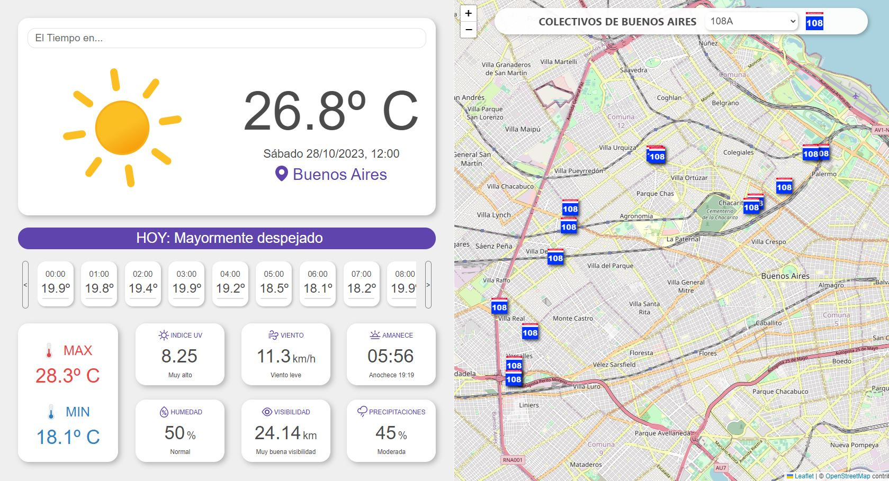

# Aplicación de clima y transporte en REACT 🌤️🚌

¡Bienvenido/a a la Aplicación de clima y transporte desarrollada con React! Esta aplicación proporciona información detallada sobre el clima actual, el pronóstico diario y otros datos relevantes, como el índice UV, la velocidad del viento, la humedad, la visibilidad y la calidad del aire. Y por otro lado tambien podes obtener la ubicacion en tiempo real de los colectivos de Buenos Aires que se actualiza cada 30 segundos.

Esta aplicación se creó como parte de un proyecto práctico durante la formación en "Argentina Programa 4.0", ofrecida por FAMAF - UNC en el año 2023. | 👨‍🎓 Desarrollador: Marcos Mingo.

## Captura de Pantalla 📸

## Estructura del Proyecto

El proyecto está organizado en varios archivos y directorios que cumplen diferentes funciones. A continuación, se describen estos componentes y archivos claves:

### Componentes de React
#### CLIMA

1. ☀️ **TopImagenClima**: Este componente muestra una imagen que representa el estado del clima actual.

2. 🌍 **TopInputCiudad**: Se utiliza para ingresar el nombre de la ciudad cuyo clima se quiere consultar.

3. 🌡️ **TopTemperaturaActual**: Muestra la temperatura actual en grados Celsius.

4. 📅 **TopDia**: Muestra el nombre del día actual, la fecha actual y la hora actual.

5. 🏙️ **TopCiudad**: Muestra la ubicación actual.

6. 🌤️ **CenterClimaHoy**: Muestra el estado del clima para el día actual.

7. 🕒 **CenterHoraTemperatura**: Muestra la temperatura por hora para el día actual.

8. 🌡️ **FooterMaxMin**: Muestra las temperaturas máxima y mínima para el día actual.

9. 🌎 **FooterIndices**: Muestra varios índices relacionados con el clima, como el índice UV, la velocidad del viento, la hora del amanecer y otros.

#### TRANSPORTE

1. 🚌 **Selector de Linea**: Podes seleccionar la linea de colectivo que quieras visualizar en el mapa en tiempo real.

2. 💬 **Popup**: Puedes seleccionar el icono de la linea que aparece en el mapa y podras obtener detalles como la agencia, la velocidad y la direccion a la que se dirige.

## Consumo de APIS

La App consume 2 APIS, obtiene datos de clima de la API "Open Meteo" y realiza consultas de la ubicación de los colectivos de Buenos Aires con la API oficial del transporte de Buenos Aires.

## Scroll Horizontal

La aplicación permite desplazarse horizontalmente por las temperaturas por hora para el día actual utilizando los botones "&lt;" y "&gt;".

## Descripción de los índices extras

El código utiliza condiciones para determinar una descripcion en base al valor actual del índice. Estos comentarios se muestran en la parte inferior de la aplicación.

## Ejecutar la Aplicación ▶️

Para ejecutar la aplicación, se necesita un entorno de desarrollo de React configurado. Puede seguir estos pasos:

1. Clonar el repositorio.

2. Asegurarse de tener Node.js y npm instalados en su sistema.

3. En el directorio raíz del proyecto, ejecute `npm install` para instalar las dependencias.

4. Luego, ejecute `npm start` para iniciar la aplicación en un servidor de desarrollo.

5. Abra su navegador y vaya a `http://localhost:3000` para ver la aplicación en funcionamiento.

6. Tambien puede **Navegar a:** https://marcosmin.github.io/ArgProgAPI/ 🌐

## Conclusiones

Este proyecto proporciona una aplicación de pronóstico del clima que muestra información relevante de manera organizada y atractiva. El código se basa en React y utiliza la API "Open Meteo" para mostrar datos y pronósticos en tiempo real. La aplicación también incorpora una descripcion personalizada segun el valor del indice para proporcionar una experiencia de usuario completa. Tambien realiza consultas de la ubicación en tiempo real de los colectivos de Buenos Aires con la API oficial del transporte de la ciudad.

---
Hecho con ❤️ por [Marcos Mingo](https://github.com/marcosmin) 😊